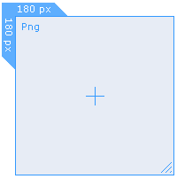
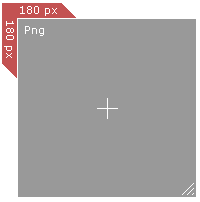
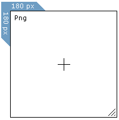
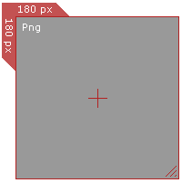
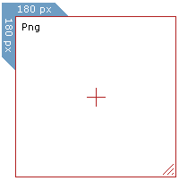
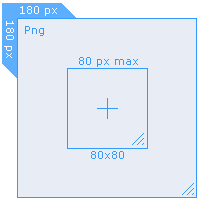
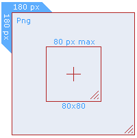

### Available Color Tables
Cropper saves the currently selected color table with other configuration data so that your selection will be preserved between usages. You can cycle through color tables by pressing the TAB key or by selecting Next Color on the context menu.

  

When capturing, Cropper will highlight the capturing border (you may not see the highlighting if you have the hide crop window during capture checked).

  

### Thumbnail
 
